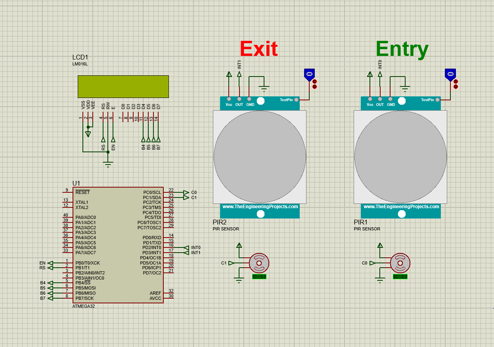

<h1 align="center"> Garage system </h1>

 Garage system using Atmega32 with IR and servo motors   

<h2> Requirements </h2>

- Atmega32 microcontroller

- 2 PIR (Passive Infrared sensor)

- LCD

- 2 Servo motors

<h2> System design </h2>

 
